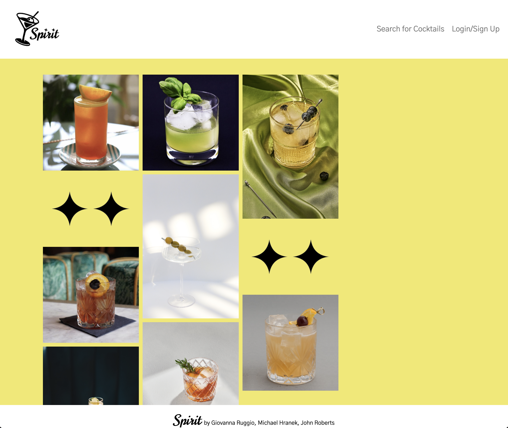

# ✧ Spirit ✧

## Description

Spirit is a web application which allows users (of legal drinking age) to explore the world of creative cocktails! It leverages the CocktailDB API, and provides users with a clean and interesting experience. Users can search our application for a variety of cocktails, and when they find one they like they can save it to their own specific user list. This functionality is protected with our user authentication. 

This project is a collaborative MERN stack single-page application, which combines a scalable MongoDB back end, a GraphQL API, and an Express.js and Node.js server with a React front end. It implements user authentication with JWT to build a user-focused platform. 

## Table of Contents
- [Installation](#installation)
- [Usage](#usage)
- [Visual](#visual)
- [Credits](#credits) 
- [Links](#links)

## Installation

Once you have the repository cloned down from github, ensure that all dependancies are installed and that your .env file is accurate and includes all necessary information. In the CLI run "npm run develop" to spin up the react application. 

## Usage

Below is a link to a video that demos the functionality of our application.
- https://drive.google.com/file/d/1DH3QkZxcEVXB88W0zjt2RofK85v1pwzh/view?usp=sharing

## Visuals

## Credits

This application was created collaboratively by Giovanna Ruggio, John Roberts, and Michael Hranek.

- https://github.com/giovannaruggio
- https://github.com/robertsjn2000
- https://github.com/MHranek

Credit to class activites, my amazing instructors and peers!

## Links

- GitHub Repository
    - https://github.com/giovannaruggio/spirit

- Heroku Deployed Link
    - https://murmuring-fortress-85951.herokuapp.com/

- Link to presentation
    - https://docs.google.com/presentation/d/16n9NCPnCm2E9bWQd420_mw8fxnIIwBAUVlsRZb7MHlc/edit?usp=sharing

    

    

